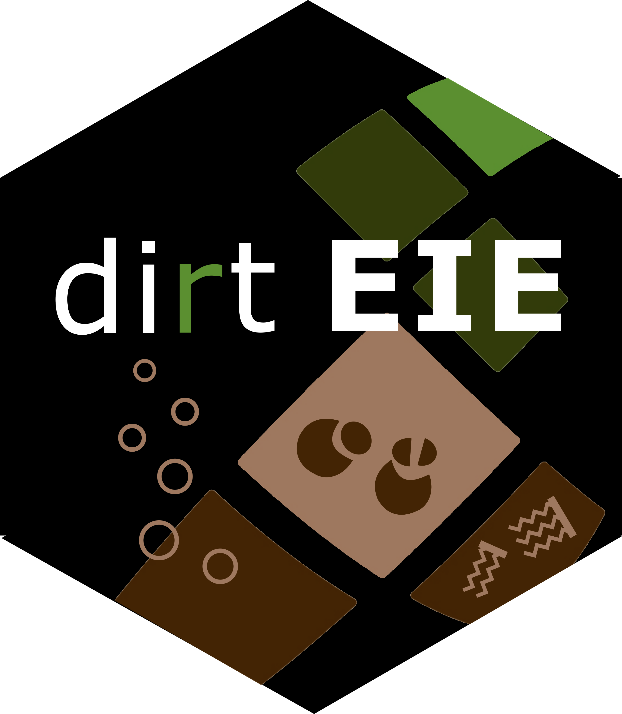

<!-- README.md is generated from README.Rmd. Please edit that file -->

```{r, include = FALSE}
knitr::opts_chunk$set(
  collapse = TRUE,
  comment = "#>",
  fig.path = "man/figures/README-",
  out.width = "100%"
)
options(tibble.print_min = 5, tibble.print_max = 5)
```

# dirtEIE </a>

## Overview

dirtEIE aims to provide functions to ease and streamline lab data processing and analyses commonly performed in the [EIE group] (https://www.idiv.de/en/groups-and-people/core-groups/experimental-interaction-ecology.html).

The package aims to provide workflows for the following data types, some of which are currently being implemented :

* O2 micro-compensation measurements (basal respiration, microbial carbon, etc.)

Further areas that are planned include:

* Soil enzymes
* MicroResp
* Nematodes

Do not hesitate to contact us if you would like to be involved in the package development.


## Installation

```{r, eval = FALSE}
# The package can be installed using:
remotes::install_github("gpatoine/dirtEIE")

```


## Getting help

Please contact us if you encounter issues with the functions provided, or would like to suggest a modification
